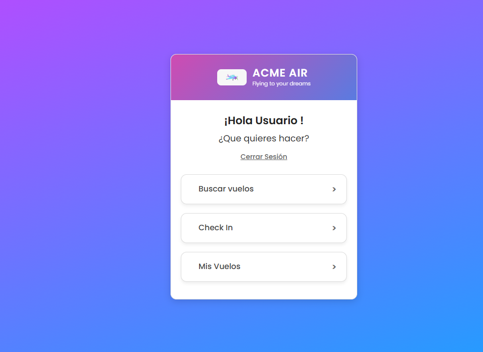
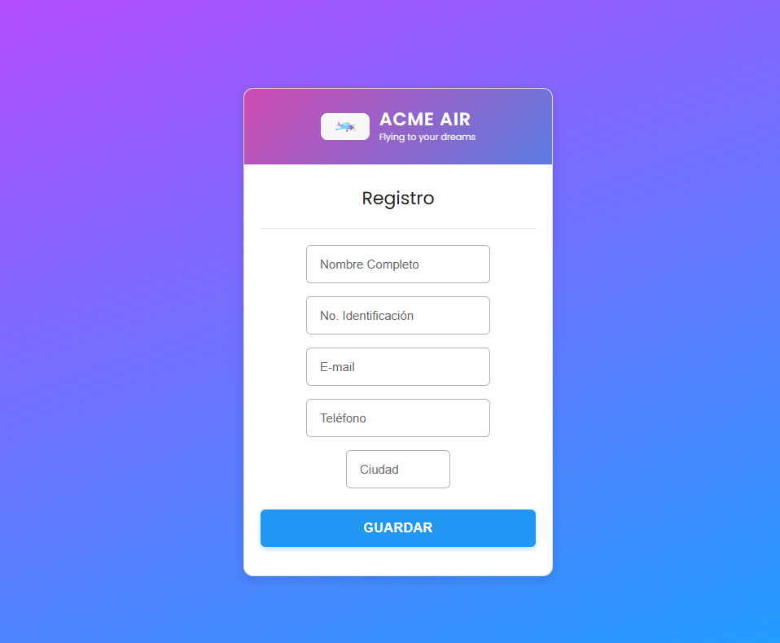
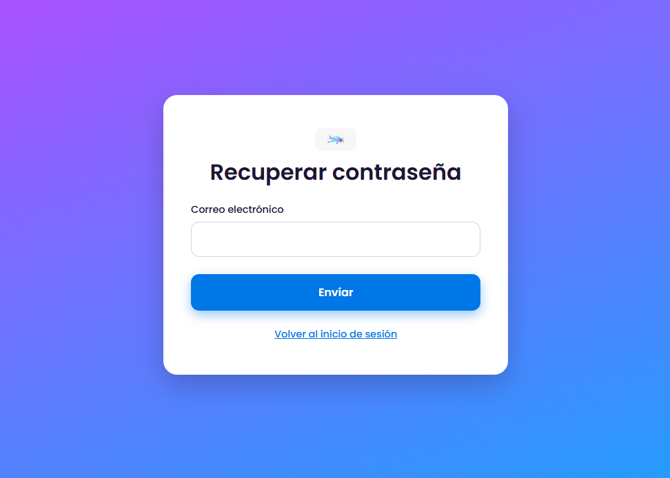
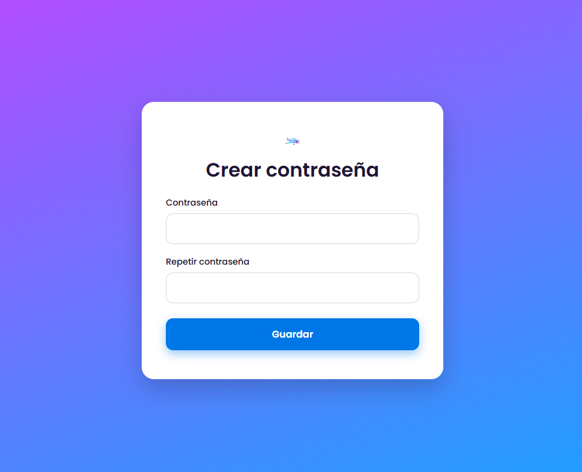
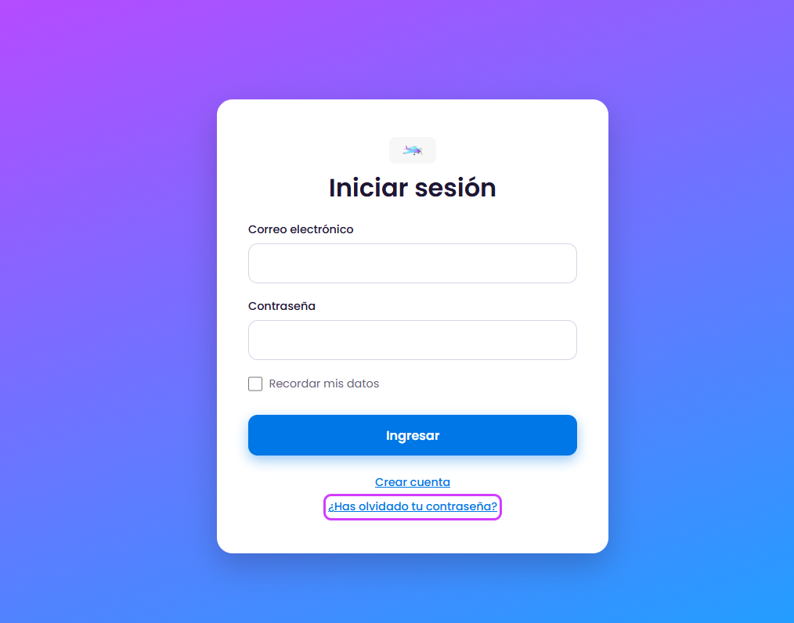
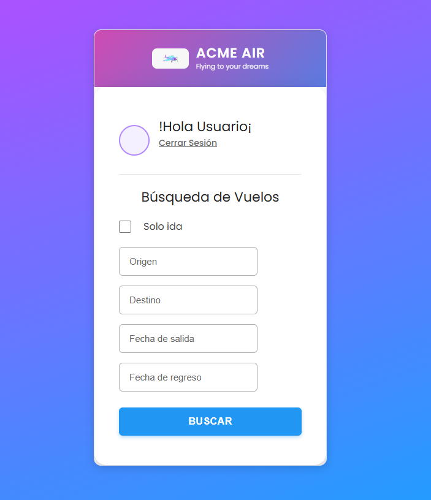
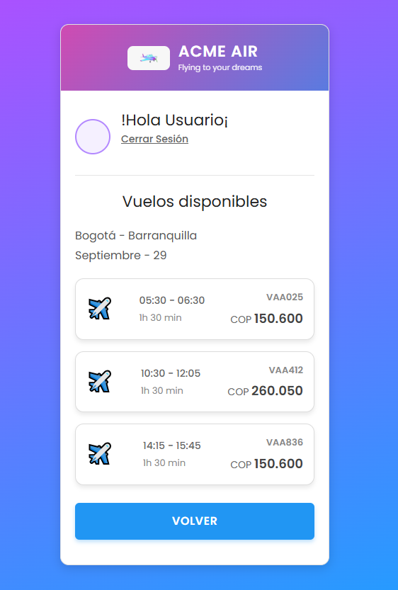
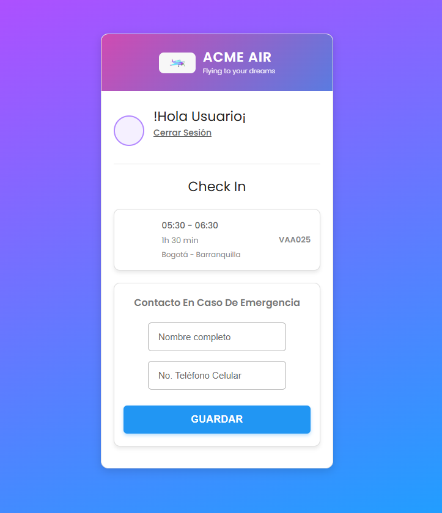
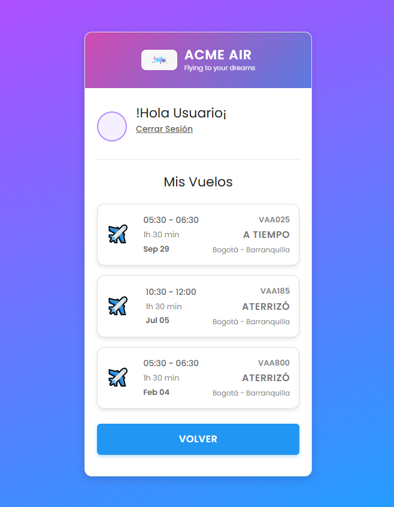

# ACME AIR - Sistema de Reserva y Gestión de Vuelos 

**Slogan:** *Flying to your dreams*

---

## Descripción del Proyecto

**ACME AIR** es un prototipo de interfaz web frontend diseñado para la gestión y reserva de vuelos comerciales. El proyecto ofrece una experiencia fluida e intuitiva enfocada en la facilidad de navegación y el diseño responsivo (enfoque *Mobile-First*). 

La plataforma permite a los usuarios:
* Crear cuenta, autenticarse y recuperar/restablecer su contraseña.
* Buscar itinerarios de vuelos de ida o ida y vuelta entre distintos destinos.
* Visualizar la lista de vuelos disponibles y sus respectivos precios en pesos colombianos (COP).
* Realizar el proceso de **Check-In** ingresando información de contacto en caso de emergencia.
* Consultar el estado en tiempo real y el historial de sus vuelos (*A TIEMPO*, *ATERRIZÓ*).

---

##  Estructura del Código Fuente

El proyecto sigue una arquitectura modular separando las vistas semánticas en HTML y la presentación visual en múltiples hojas de estilo CSS:

```text
├── css/
│   ├── forms.css       # Estilos específicos para formularios, inputs y botones
│   ├── layout.css      # Estructura principal, distribución y contenedores tipo tarjeta
│   ├── responsive.css  # Adaptación responsive (Mobile-first, Tablets y Desktop)
│   └── style.css       # Estilos globales, paleta de colores, tipografía Poppins y componentes
├── img/
│   └── icono.jpg       # Logotipo oficial de ACME AIR
├── buscar_vuelos.html  # Formulario de búsqueda de vuelos
├── checkin.html        # Formulario de Check-In y registro de emergencia
├── crear-clave.html    # Asignación de nueva contraseña
├── Login.html          # Formulario de inicio de sesión
├── menu.html           # Menú principal de navegación del usuario
├── mis_vuelos.html     # Historial y estado de vuelos del usuario
├── recuperar-clave.html# Solicitud de restablecimiento de contraseña
├── registro.html       # Registro de nuevos usuarios
└── vuelos.html         # Resultados de búsqueda de vuelos disponibles
```

---

##  Guía de Navegación

### Flujo Principal de Navegación

```
                        ┌──────────────────┐
                        │    Login.html    │
                        └────────┬─────────┘
                                 │
          ┌──────────────────────┼──────────────────────┐
          ▼                      ▼                      ▼
┌──────────────────┐    ┌──────────────────┐   ┌──────────────────┐
│  registro.html   │    │recuperar-clave...│   │    menu.html     │
└────────┬─────────┘    └────────┬─────────┘   └────────┬─────────┘
         │                       │                      │
         └───────────┬───────────┘                      │
                     ▼                                  │
          ┌─────────────────────┐                       │
          │  crear-clave.html   │                       │
          └──────────┬──────────┘                       │
                     └──────────────────────────────────┘
                                                        │
          ┌─────────────────────────────────────────────┼─────────────────────────────────────────────┐
          ▼                                             ▼                                             ▼
┌──────────────────┐                        ┌──────────────────┐                          ┌──────────────────┐
│buscar_vuelos.html│                        │   checkin.html   │                          │ mis_vuelos.html  │
└────────┬─────────┘                        └──────────────────┘                          └──────────────────┘
         ▼
 ┌───────────────┐
 │  vuelos.html  │
 └───────────────┘
```

### Detalle de las Vistas

1. **Autenticación e Inicio**
   * `Login.html`: Pantalla de entrada con campos para correo electrónico, contraseña, opción "Recordar mis datos" y enlaces hacia el registro o recuperación de clave.
   * `registro.html`: Permite recopilar información del usuario: Nombre Completo, Identificación, E-mail, Teléfono y Ciudad de origen (Bogotá, Medellín, Cali, Bucaramanga).
   * `recuperar-clave.html`: Captura el correo electrónico del usuario para enviar la solicitud de restauración.
   * `crear-clave.html`: Formulario para ingresar y confirmar la nueva contraseña.

2. **Panel Principal**
   * `menu.html`: Hub central del usuario autenticado ("¡Hola Usuario!"). Ofrece accesos directos a *Buscar Vuelos*, *Check In*, *Mis Vuelos* y la opción *Cerrar Sesión*.

3. **Módulos de Gestión de Vuelos**
   * `buscar_vuelos.html`: Filtro de búsqueda con campos de Origen, Destino, Fecha de Salida, Fecha de Regreso y casilla para vuelo de "Solo ida".
   * `vuelos.html`: Muestra los resultados de búsqueda para el itinerario seleccionado (ej. *Bogotá - Barranquilla*) listando horarios, duración, código de vuelo (ej. *VAA025*) y costo en COP.
   * `checkin.html`: Muestra el resumen del vuelo próximo e incluye el formulario obligatorio "Contacto En Caso De Emergencia" (Nombre completo y Teléfono Celular).
   * `mis_vuelos.html`: Listado histórico de trayectos del usuario indicando fecha, horario, ruta y estado actual (*A TIEMPO*, *ATERRIZÓ*).

---

##  Capturas de las Vistas


### 1. Módulo de Autenticación y Registro

| Iniciar Sesión (`Login.html`) | Registro de Usuario (`registro.html`) |
| :---: | :---: |
|  |  |

| Recuperar Contraseña (`recuperar-clave.html`) | Crear Contraseña (`crear-clave.html`) |
| :---: | :---: |
|  |  |

---

### 2. Panel Principal y Búsqueda de Vuelos

| Menú Principal (`menu.html`) | Búsqueda de Vuelos (`buscar_vuelos.html`) |
| :---: | :---: |
|  |  |

| Resultados de Vuelos (`vuelos.html`) |
| :---: |
|  |

---

### 3. Check-In y Gestión de Mis Vuelos

| Proceso de Check-In (`checkin.html`) | Historial de Vuelos (`mis_vuelos.html`) |
| :---: | :---: |
|  |  |

---

##  Tecnologías Utilizadas

* **HTML5:** Estructuración semántica de formularios, campos de datos e hipervínculos de navegación.
* **CSS3 (Modular):**
  * `Variables CSS (`:root`)`: Definición centralizada de colores primarios (`#d13cff`, `#00b0ff`, `#0077e6`), bordes y border-radius.
  * `Flexbox`: Alineación y distribución responsiva de elementos en tarjetas y formularios.
  * `Media Queries`: Adaptación fluida para pantallas móviles (320px+), tablets (768px+) y monitores (1024px+).

